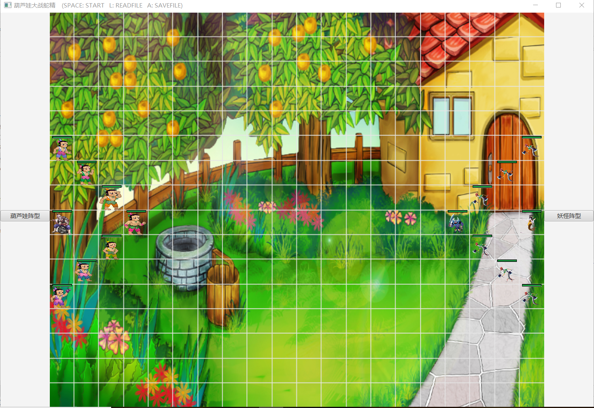
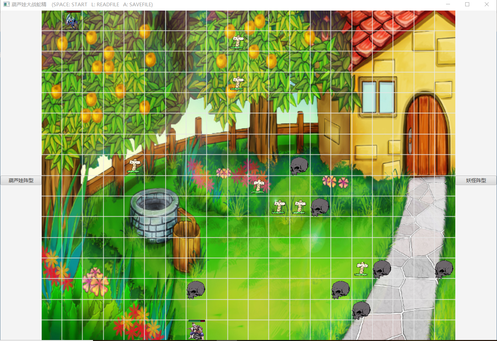
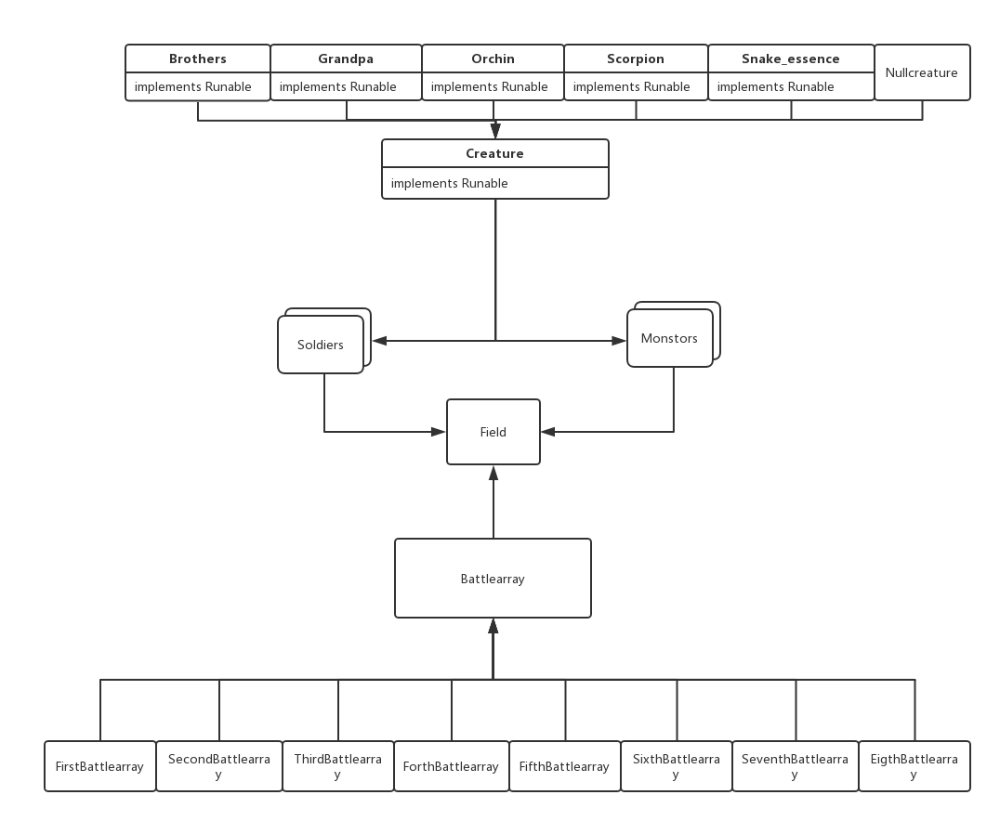

# 设计说明

## 效果展示






## 功能说明

### 1.功能键

#### 	键位只有三个，分别是*SPACE*，*A*和*L*，三个键位的功能分别是：

##### 		SPACE：可以开始对战，任何时候都可以摁SPACE键，在正常对战中，摁SPACE为无效反应，在复盘中，摁SPACE则是开始新的对战，取消当前复盘

##### 		A：A是保存文件，必须是在已经进行过正常对战的情况下，才能够进行保存文件（复盘之后，若复盘前进行过正常对战，也可以进行保存）

##### 		L：L是读取文档，然后自动开始复盘，若为选择文件，那么会跳出提示，并且保留原先的正常对战的最后结果

### 2.对战双方

##### 	因为如果双方碰到随机死亡太过激情，所以我加入了血条，让双方可以多次一对一战斗，每个生物的属性都各不相同，导致了每种生物的死亡时间不同。因为有攻击力和防御力，所以设置了若一方的攻击力小于另一方的防御力，则制造成1点的伤害；若大于，则就是攻击力-防御力。

### 3.对战

##### 	因为对各种的跑位算法都设置为随机，但是将一个生物的小范围内设置了战斗算法，若是发现敌对势力，会选择黏斗还是选择离开。所以就会出现双方黏着战斗或者被另一方追着打，因为是设置了单方向攻击，所以若双方都是最后一击，那么会出现先死亡一方无效攻击。这样就会让结局出现较多的不一样。

### 4.开始前的键位

##### 	在棋盘的两边有两个摁键，是可以改变妖怪和葫芦娃双方的阵型的。（因为大娃和蝎子精是这个游戏里的爸爸，所以若是让这俩个生物对弱小的生物进行最大化杀伤，就能获得胜利（最大化杀伤：攻击对面造成有效伤害，而对面被一击补掉或者攻击力小于己方防御力，只能造成1点伤害)）


## UML类图




## 面向对象的具体体现

### 封装

##### 	封装对外隐藏内部的实现，于是保证了内部实现的变化不会影响外部使用，基本属性全部用了private或者protected，仅提供查询和操作的方法窗口

##### 	例如Creature虚类里的getPath()，getBlood_current_volumn等函数，是返回只对内的List<Path>和blood_current_volumne.

>

```
public List<Integer> getBloodrecord()
{
    return this.bloodrecord;
}
public List<Point> getPath()
{
    return this.path;
}
public ImageView getImage()
{
    return this.image;
}
public ImageView getBlood()
{
    return this.blood;
}
public ImageView getBloodbackground()
{
    return this.bloodbackground;
}
public String getName()
{
    return this.name;
}
public int getX()
{
    return this.x;
}
public int getY()
{
    return this.y;
}
public int getBlood_current_volumn()
{
    return this.blood_current_volumn;
}
```

### 继承

##### 	该方面的设计已经非常明显，见于UML图，在Creature虚类和众生物出可见


### 多态

##### 	Battlearray接口，8个阵型对此类进行各自的实现，Field里使用makefield函数的时候，会根据取值，对Battlearray进行调用，从而调用具体对象。

>

```
public interface Battlearray {
    void createbattlearray(Field f, boolean left);
}
```


##### 	在Soldiers和Monsters两个类中，存放各种Creature，从而达到多态的效果，可以调用该类型的集合从而得到不同的Creature对象

>

```
public Soldiers(Creature one)
{
    this.one=one;
}
```

>

```
public Monstors(Creature one)
{
    this.one=one;
}
```

### 主要的设计原则

#### ISP 接口隔离原则

##### 接口应精简单一，体现在Formation接口和Runnable接口，只需要重写一个方法。

 

#### DIP 依赖倒置原则

##### 要求面向抽象编程，具体而言所有的继承都应终止于接口或虚类,所有的继承终止于接口Battlearray、Runnable和虚类Creature。

 

#### CARP 合成/聚合复用原则

##### Replay里和Field里聚合了一些类的对象。


### java机制

#### 异常处理

##### 	在读写文件和线程的运行方面使用了java的异常处理机制

>

```
 public void run() {
        while(...)
        {
            try {
            	...
                f.go(this);
                Thread.sleep(100);
            } catch (InterruptedException e) {
                e.printStackTrace();
            }
        }
    }
}
```


#### 集合类型

```
private List<Thread> ALLTHREAD=new ArrayList<Thread>();
private List<List<Point>> ALLPATH=new ArrayList<List<Point>>();
...
```


#### 读写文件

savefile&&readfile

>

```
public void saveFile()
{
    JFileChooser chooser = new JFileChooser();
    chooser.showSaveDialog(null);
    File file = chooser.getSelectedFile();
    if (file == null)
        JOptionPane.showMessageDialog(null, "没有选择文件");
    else {
        try {
            PrintWriter out = new PrintWriter(new FileOutputStream(file, true));
            ...
            out.close();
        } catch (FileNotFoundException e) {
            e.printStackTrace();
        }
    }
}
```

>

```
public boolean readFile()
{
    
    JFileChooser chooser = new JFileChooser();
    chooser.showOpenDialog(null);
    File file = chooser.getSelectedFile();
    if (file == null)
    {
        JOptionPane.showMessageDialog(null, "没有选择文件");
        return false;
    }
    else {
        try {
            BufferedReader br=new BufferedReader(new FileReader(file));
            ...
            }
        } catch (IOException e) {
            e.printStackTrace();
        }
    }
    return true;
}
```


#### 线程

每一个Creature一个线程，集中在Thread的集合里面，统一开启，对所使用的资源进行锁定，不会产生冲突。

>

```
private synchronized void move(Creature one, int x, int y)
{
    synchronized(this)
    {
        Creature two;
        field.get(one.x).set(one.y,two=new Nullcreature(one.x,one.y));
        one.movecreature(x,y);
        field.get(x).set(y,one);
    }
}
```


#### 单元测试

对战场初始化，文件读写，Creature之间对战进行了单元测试


### 使用说明：

SPACE开始（正常对战中摁键无效）

A保存文件

L打开文件，自动复盘

两侧摁键可以在正常对战之前改变阵型